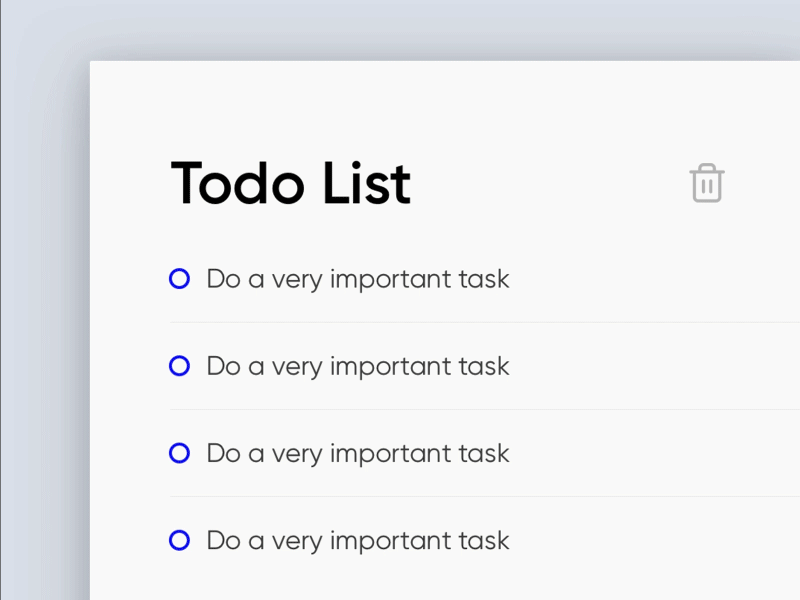

A simple and intuitive To-Do App to help you stay organized.

- Introduction
- Features
- Installation
- Usage
- Screenshots
- Contributing
- License
  
Introduction
---
The To-Do App is designed to assist users in managing their tasks efficiently. It provides a clean and user-friendly interface to add, edit, and delete tasks.

Feature
---
- Add tasks with description and due dates.
- Mark tasks as complete.
- Edit existing tasks.
- Delete tasks.
- Simple and intuitive user interface

